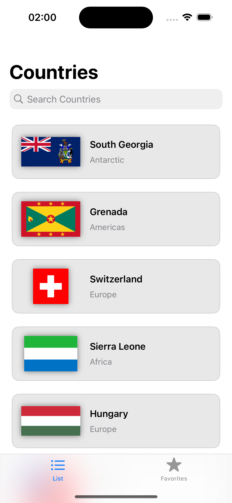
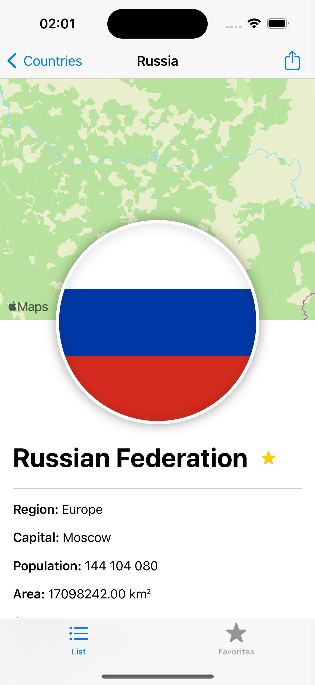
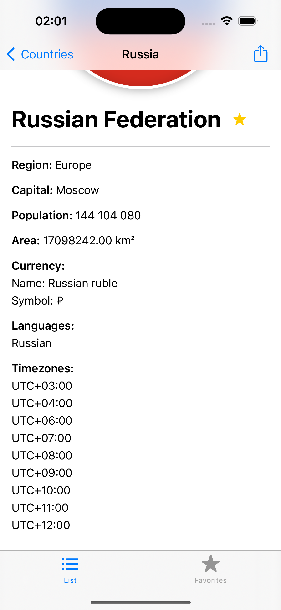
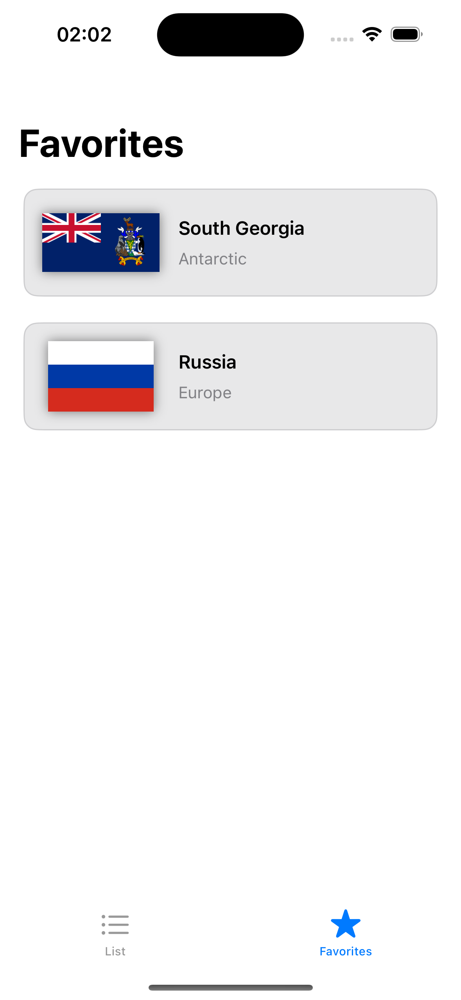

## Это тестовое приложение с использованием REST COUNTRIES [API](https://restcountries.com)

### Описание приложения:
1) Стартовый экран — таббар с двумя вкладками: 
- На первой вкладке — список стран. При нажатии на ячейку пользователь попадает на экран подробной информации;
- На второй вкладке — списк избранных стран. При нажатии на страну также переход в экран подробной информации.

## Краткое описание технологий и решений:
- **Язык программирования**: Swift
- **Фреймворки и библиотеки**:
  - **SwiftUI**: для создания пользовательского интерфейса.
  - **SwiftData**: для хранения и управления данными (для работы с избранными странами).
  - **Async/Await**: для работы с асинхронным кодом и реактивного программирования.
- **Технологии локализации**: `Localizable.xcstrings` для локализации сообщений в приложении.
- **Архитектура**: MVVM

  
  
  
  

